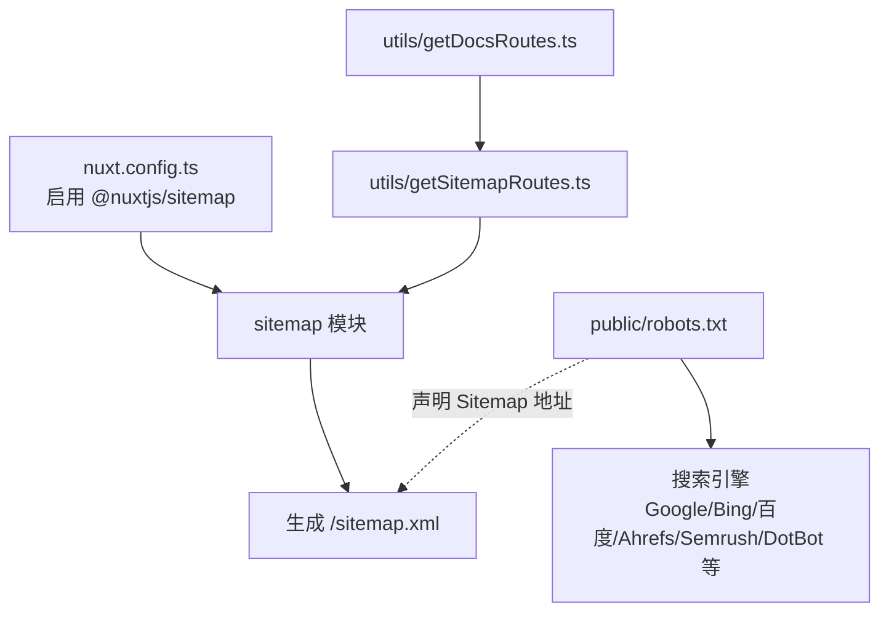
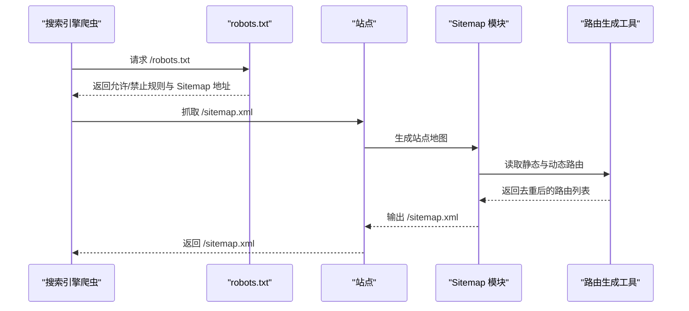
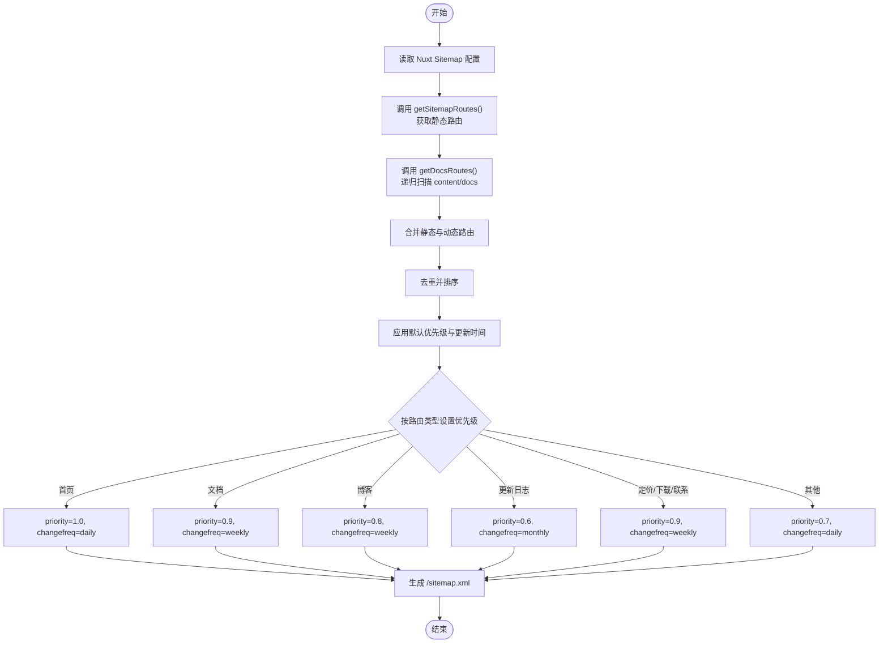
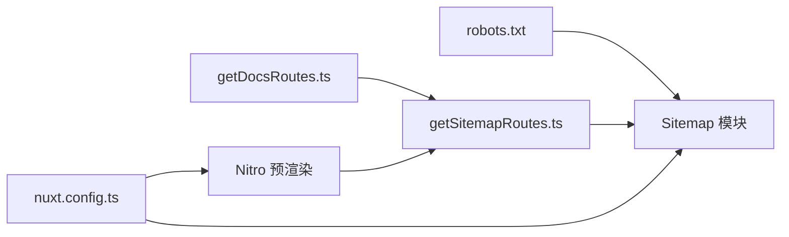

# robots.txt 配置

<cite>
**本文引用的文件**
- [public/robots.txt](file://public/robots.txt)
- [nuxt.config.ts](file://nuxt.config.ts)
- [utils/getSitemapRoutes.ts](file://utils/getSitemapRoutes.ts)
- [utils/getDocsRoutes.ts](file://utils/getDocsRoutes.ts)
- [README.md](file://README.md)
</cite>

## 目录
1. [简介](#简介)
2. [项目结构](#项目结构)
3. [核心组件](#核心组件)
4. [架构总览](#架构总览)
5. [详细组件分析](#详细组件分析)
6. [依赖关系分析](#依赖关系分析)
7. [性能考量](#性能考量)
8. [故障排查指南](#故障排查指南)
9. [结论](#结论)

## 简介
本文件围绕站点的 robots.txt 配置进行系统化说明，结合 Nuxt 配置与工具函数，解释如何通过静态 robots.txt 与 Nuxt Sitemap 模块协同工作，实现对搜索引擎爬虫的精细化控制，并确保站点地图正确生成与可访问。

## 项目结构
- robots.txt 位于 public 目录下，作为静态文件直接提供给搜索引擎。
- Nuxt 配置文件中启用了 Sitemap 模块，并通过工具函数生成站点地图路由列表。
- 工具函数负责汇总静态页面与动态文档路由，形成完整的 sitemap 输入。

**图表来源**
- [public/robots.txt](file://public/robots.txt#L1-L51)
- [nuxt.config.ts](file://nuxt.config.ts#L18-L23)
- [nuxt.config.ts](file://nuxt.config.ts#L42-L94)
- [utils/getSitemapRoutes.ts](file://utils/getSitemapRoutes.ts#L1-L42)
- [utils/getDocsRoutes.ts](file://utils/getDocsRoutes.ts#L1-L58)

**章节来源**
- [public/robots.txt](file://public/robots.txt#L1-L51)
- [nuxt.config.ts](file://nuxt.config.ts#L18-L23)
- [nuxt.config.ts](file://nuxt.config.ts#L42-L94)
- [utils/getSitemapRoutes.ts](file://utils/getSitemapRoutes.ts#L1-L42)
- [utils/getDocsRoutes.ts](file://utils/getDocsRoutes.ts#L1-L58)
- [README.md](file://README.md#L57-L66)

## 核心组件
- 静态 robots.txt：定义全局允许/禁止规则、特定爬虫的例外规则、禁止恶意爬虫、以及 sitemap 地址。
- Nuxt Sitemap 模块：在构建阶段生成站点地图，支持默认优先级与按路由类型差异化优先级。
- 路由生成工具：
  - getDocsRoutes：递归扫描 content/docs，生成文档路由。
  - getSitemapRoutes：合并静态页面与动态文档路由，去重并排序。

这些组件共同保证：
- robots.txt 对搜索引擎的指引明确；
- Sitemap 模块生成的 sitemap.xml 能被正确抓取；
- 文档路由纳入预渲染与 sitemap，提升 SEO 覆盖。

**章节来源**
- [public/robots.txt](file://public/robots.txt#L1-L51)
- [nuxt.config.ts](file://nuxt.config.ts#L42-L94)
- [utils/getSitemapRoutes.ts](file://utils/getSitemapRoutes.ts#L1-L42)
- [utils/getDocsRoutes.ts](file://utils/getDocsRoutes.ts#L1-L58)

## 架构总览
下图展示 robots.txt 与 Sitemap 模块在 Nuxt 中的协作流程：

**图表来源**
- [public/robots.txt](file://public/robots.txt#L1-L51)
- [nuxt.config.ts](file://nuxt.config.ts#L42-L94)
- [utils/getSitemapRoutes.ts](file://utils/getSitemapRoutes.ts#L1-L42)
- [utils/getDocsRoutes.ts](file://utils/getDocsRoutes.ts#L1-L58)

## 详细组件分析

### robots.txt 规则解读
- 全局规则：允许所有爬虫抓取根路径与公开内容。
- 禁止路径：/api/、/admin/、/_nuxt/ 等后台或构建产物目录。
- 允许路径：文档、博客、更新日志、定价、下载、联系、关于、解决方案、资源等重要页面。
- Sitemap 地址：指向站点根域下的 sitemap.xml。
- 特定爬虫规则：Googlebot、Bingbot、Baiduspider 明确允许抓取。
- 爬取频率：保留字段（注释）未启用。
- 恶意爬虫：AhrefsBot、SemrushBot、DotBot 禁止抓取。

上述规则与 Nuxt 的预渲染与 Sitemap 生成配合，确保搜索引擎优先抓取业务页面，避免抓取后台或构建产物。

**章节来源**
- [public/robots.txt](file://public/robots.txt#L1-L51)

### Sitemap 模块与路由生成
- 模块启用：在 Nuxt 配置中启用 @nuxtjs/sitemap 模块。
- 站点基础 URL：通过 site.url 指定。
- 路由来源：sitemap.urls 使用 getSitemapRoutes 动态生成。
- 排除规则：/demo 页面不进入 sitemap。
- 默认优先级：每日更新、默认优先级、最后修改时间。
- 路由差异化优先级：首页最高、文档与博客较高、更新日志较低、部分页面中等。
- 预渲染注入：nitro.prerender.routes 注入动态文档路由，确保静态化。

**图表来源**
- [nuxt.config.ts](file://nuxt.config.ts#L42-L94)
- [utils/getSitemapRoutes.ts](file://utils/getSitemapRoutes.ts#L1-L42)
- [utils/getDocsRoutes.ts](file://utils/getDocsRoutes.ts#L1-L58)

**章节来源**
- [nuxt.config.ts](file://nuxt.config.ts#L42-L94)
- [utils/getSitemapRoutes.ts](file://utils/getSitemapRoutes.ts#L1-L42)
- [utils/getDocsRoutes.ts](file://utils/getDocsRoutes.ts#L1-L58)

### 预渲染与静态化
- Nitro 预设：static 强制静态输出，便于部署与 SEO。
- 预渲染路由：将动态文档路由注入到 prerender.routes，确保页面静态化。
- 这样即使 robots.txt 仅允许抓取公开路径，也能确保文档页面被静态生成并可被抓取。

**章节来源**
- [nuxt.config.ts](file://nuxt.config.ts#L95-L106)
- [README.md](file://README.md#L57-L66)

## 依赖关系分析
- robots.txt 依赖于站点的公开路径与后台路径划分，确保搜索引擎不会抓取 /api/、/admin/、/_nuxt/ 等。
- Sitemap 模块依赖于路由生成工具，后者依赖 content/docs 目录结构。
- Nuxt 预渲染依赖于动态文档路由，确保文档页面静态化。

**图表来源**
- [public/robots.txt](file://public/robots.txt#L1-L51)
- [nuxt.config.ts](file://nuxt.config.ts#L42-L94)
- [utils/getSitemapRoutes.ts](file://utils/getSitemapRoutes.ts#L1-L42)
- [utils/getDocsRoutes.ts](file://utils/getDocsRoutes.ts#L1-L58)

**章节来源**
- [public/robots.txt](file://public/robots.txt#L1-L51)
- [nuxt.config.ts](file://nuxt.config.ts#L42-L94)
- [utils/getSitemapRoutes.ts](file://utils/getSitemapRoutes.ts#L1-L42)
- [utils/getDocsRoutes.ts](file://utils/getDocsRoutes.ts#L1-L58)

## 性能考量
- 静态输出与预渲染：通过 Nitro static 与 prerender.routes，减少运行时开销，提升爬虫抓取效率。
- 路由去重与排序：在生成 sitemap 路由时进行去重与排序，避免重复条目与无序输出。
- 优先级与更新频率：为不同类型的页面设置合理的优先级与更新频率，有助于搜索引擎更高效地抓取与索引。

[本节为通用指导，无需列出具体文件来源]

## 故障排查指南
- sitemap.xml 无法访问
  - 检查 robots.txt 是否禁止抓取 /sitemap.xml 或相关路径。
  - 确认 Nuxt Sitemap 模块已启用且配置正确。
  - 确认站点基础 URL 与 sitemap 地址一致。
  - 参考：[nuxt.config.ts](file://nuxt.config.ts#L42-L94)，[public/robots.txt](file://public/robots.txt#L24-L26)
- 文档页面未出现在 sitemap
  - 检查 content/docs 目录是否存在且命名规范是否符合预期。
  - 确认 getDocsRoutes 生成的路由已被 getSitemapRoutes 合并。
  - 参考：[utils/getDocsRoutes.ts](file://utils/getDocsRoutes.ts#L1-L58)，[utils/getSitemapRoutes.ts](file://utils/getSitemapRoutes.ts#L1-L42)
- 预渲染未包含文档页面
  - 检查 nitro.prerender.routes 是否包含动态文档路由。
  - 参考：[nuxt.config.ts](file://nuxt.config.ts#L95-L106)
- 恶意爬虫仍抓取
  - 确认 robots.txt 中是否包含相应禁止规则。
  - 参考：[public/robots.txt](file://public/robots.txt#L43-L50)

**章节来源**
- [nuxt.config.ts](file://nuxt.config.ts#L42-L94)
- [nuxt.config.ts](file://nuxt.config.ts#L95-L106)
- [utils/getSitemapRoutes.ts](file://utils/getSitemapRoutes.ts#L1-L42)
- [utils/getDocsRoutes.ts](file://utils/getDocsRoutes.ts#L1-L58)
- [public/robots.txt](file://public/robots.txt#L24-L26)
- [public/robots.txt](file://public/robots.txt#L43-L50)

## 结论
通过将静态 robots.txt 与 Nuxt Sitemap 模块有机结合，并借助路由生成工具实现动态文档路由的自动化采集，本项目实现了对搜索引擎爬虫的精细控制与高效的 SEO 覆盖。建议在后续维护中持续关注：
- robots.txt 的合规性与可维护性；
- 文档目录结构变化对路由生成的影响；
- 预渲染与静态化策略的稳定性。

[本节为总结性内容，无需列出具体文件来源]