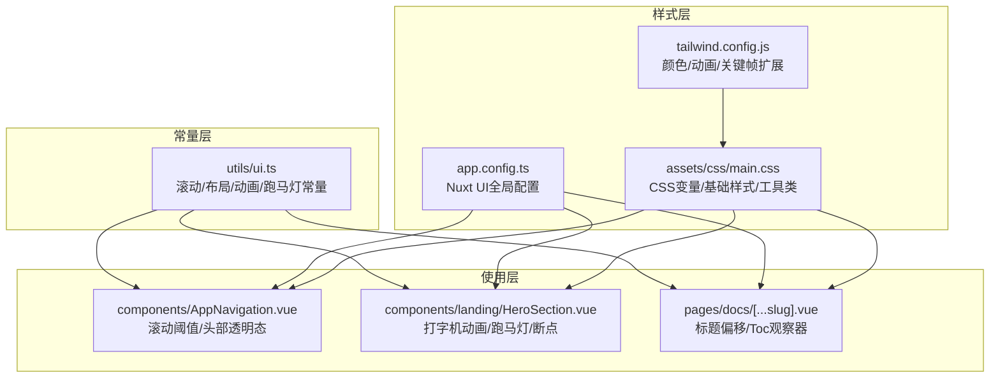
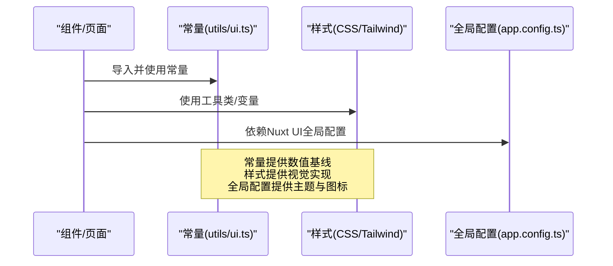
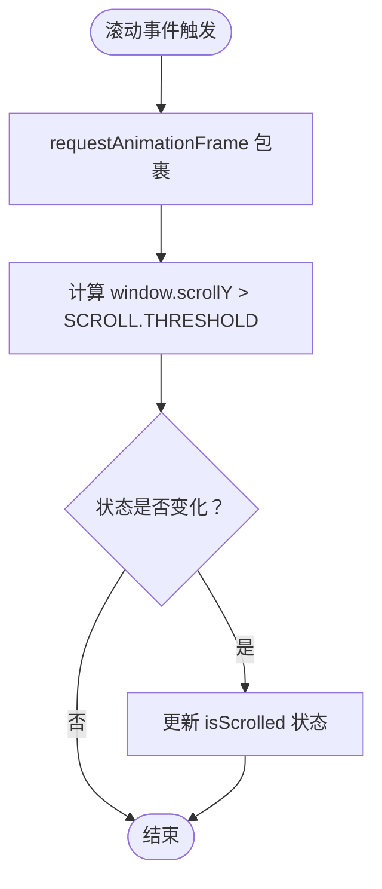
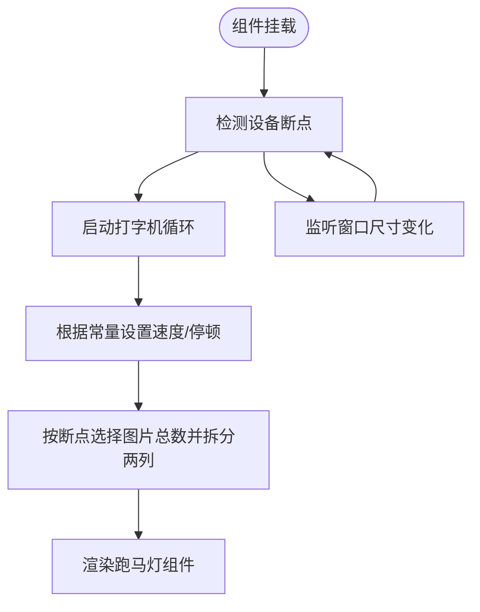
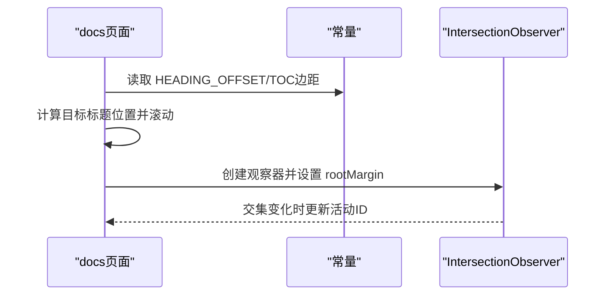
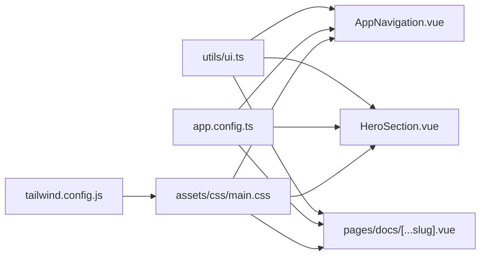

# UI常量集中化配置

<cite>
**本文引用的文件**
- [utils/ui.ts](file://utils/ui.ts)
- [tailwind.config.js](file://tailwind.config.js)
- [assets/css/main.css](file://assets/css/main.css)
- [app.config.ts](file://app.config.ts)
- [components/AppNavigation.vue](file://components/AppNavigation.vue)
- [components/landing/HeroSection.vue](file://components/landing/HeroSection.vue)
- [pages/docs/[...slug].vue](file://pages/docs/[...slug].vue)
</cite>

## 目录
1. [简介](#简介)
2. [项目结构](#项目结构)
3. [核心组件](#核心组件)
4. [架构总览](#架构总览)
5. [详细组件分析](#详细组件分析)
6. [依赖关系分析](#依赖关系分析)
7. [性能考量](#性能考量)
8. [故障排查指南](#故障排查指南)
9. [结论](#结论)

## 简介
本文件系统性梳理了项目中的“UI常量集中化配置”实践，围绕以下目标展开：
- 统一管理滚动、布局、动画、跑马灯等UI相关常量，避免魔法数字
- 通过CSS变量与Tailwind扩展，统一品牌色、圆角、动画等视觉基线
- 在组件与页面中按需引用常量，确保跨模块一致性与可维护性

该文档既适合初学者理解整体思路，也提供代码级来源定位，便于深入分析。

## 项目结构
与UI常量相关的文件分布如下：
- 常量定义：utils/ui.ts
- 主题与动画：tailwind.config.js、assets/css/main.css
- Nuxt UI全局配置：app.config.ts
- 使用示例：components/AppNavigation.vue、components/landing/HeroSection.vue、pages/docs/[...slug].vue

图表来源
- [utils/ui.ts](file://utils/ui.ts#L1-L62)
- [tailwind.config.js](file://tailwind.config.js#L1-L86)
- [assets/css/main.css](file://assets/css/main.css#L1-L145)
- [app.config.ts](file://app.config.ts#L1-L83)
- [components/AppNavigation.vue](file://components/AppNavigation.vue#L140-L310)
- [components/landing/HeroSection.vue](file://components/landing/HeroSection.vue#L192-L357)
- [pages/docs/[...slug].vue](file://pages/docs/[...slug].vue#L167-L284)

章节来源
- [utils/ui.ts](file://utils/ui.ts#L1-L62)
- [tailwind.config.js](file://tailwind.config.js#L1-L86)
- [assets/css/main.css](file://assets/css/main.css#L1-L145)
- [app.config.ts](file://app.config.ts#L1-L83)

## 核心组件
本节聚焦“UI常量集中化”的三个层面：常量定义、样式基线、全局配置，并说明它们如何协同工作。

- 常量定义（utils/ui.ts）
  - 滚动相关：滚动阈值、标题偏移、目录树（TOC）交叉观察器边距
  - 布局相关：顶部导航高度、移动端断点
  - 动画相关：打字机动画的速度与停顿
  - 跑马灯相关：移动端/桌面端图片数量

- 样式基线（tailwind.config.js、assets/css/main.css）
  - 通过Tailwind扩展颜色、动画与关键帧，保证组件动画与过渡的一致性
  - 通过CSS变量覆盖Nuxt UI主色与圆角，形成统一的品牌视觉

- 全局配置（app.config.ts）
  - 定义Nuxt UI的主品牌色与图标别名，使组件库风格与站点一致

章节来源
- [utils/ui.ts](file://utils/ui.ts#L1-L62)
- [tailwind.config.js](file://tailwind.config.js#L1-L86)
- [assets/css/main.css](file://assets/css/main.css#L1-L145)
- [app.config.ts](file://app.config.ts#L1-L83)

## 架构总览
下图展示了“常量—样式—组件”的调用链路与职责边界。

图表来源
- [utils/ui.ts](file://utils/ui.ts#L1-L62)
- [tailwind.config.js](file://tailwind.config.js#L1-L86)
- [assets/css/main.css](file://assets/css/main.css#L1-L145)
- [app.config.ts](file://app.config.ts#L1-L83)

## 详细组件分析

### 常量定义与使用（utils/ui.ts）
- 设计要点
  - 将“滚动阈值、标题偏移、TOC边距”等分散在各处的数值统一收敛到常量对象，便于修改与复用
  - 将“导航高度、移动端断点”等布局相关常量集中管理，避免重复硬编码
  - 将“打字机动画速度与停顿”、“跑马灯图片数量”等交互细节集中化，提升一致性

- 使用场景
  - 导航栏滚动切换：在组件中读取滚动阈值，决定头部透明/实体状态
  - 文档标题滚动偏移：在页面中将滚动位置减去标题偏移，避免固定头部遮挡
  - 目录树高亮：在页面中使用TOC观察器边距，控制当前章节高亮范围
  - 跑马灯与断点：在组件中依据断点选择不同布局与图片数量

章节来源
- [utils/ui.ts](file://utils/ui.ts#L1-L62)

### 样式基线（tailwind.config.js、assets/css/main.css）
- Tailwind扩展
  - 颜色：定义主色、强调色、次级色，供组件与工具类使用
  - 动画：提供淡入、上滑、轻弹等常用动画名称与关键帧
  - 关键帧：统一动画曲线与位移，保证组件动效一致性

- CSS变量与工具类
  - CSS变量：在根节点定义主品牌色与圆角半径，深色模式下覆盖主色
  - 基础样式：启用平滑滚动、统一字体与配色
  - 组件工具类：封装按钮、卡片、环形光晕等可复用样式
  - 动画工具类：提供上滑与延迟等便捷类

- 与Nuxt UI的关系
  - app.config.ts中定义主品牌色与图标别名，配合CSS变量与Tailwind扩展，形成完整的UI视觉体系

章节来源
- [tailwind.config.js](file://tailwind.config.js#L1-L86)
- [assets/css/main.css](file://assets/css/main.css#L1-L145)
- [app.config.ts](file://app.config.ts#L1-L83)

### 组件与页面中的常量使用

#### 组件：AppNavigation（滚动阈值与头部透明态）
- 关键流程
  - 使用requestAnimationFrame优化滚动事件处理
  - 读取常量中的滚动阈值，判断是否需要切换头部透明态
  - 根据透明态动态调整导航菜单的链接样式

图表来源
- [components/AppNavigation.vue](file://components/AppNavigation.vue#L268-L309)
- [utils/ui.ts](file://utils/ui.ts#L10-L22)

章节来源
- [components/AppNavigation.vue](file://components/AppNavigation.vue#L140-L310)
- [utils/ui.ts](file://utils/ui.ts#L1-L62)

#### 组件：HeroSection（打字机、跑马灯、断点）
- 关键流程
  - 打字机：根据常量中的打字/删除速度与停顿，循环输出多句文案
  - 跑马灯：根据设备断点选择移动端或桌面端图片数量，均分两列并随机打乱
  - 断点检测：监听窗口尺寸变化，动态切换移动端状态

图表来源
- [components/landing/HeroSection.vue](file://components/landing/HeroSection.vue#L256-L357)
- [utils/ui.ts](file://utils/ui.ts#L27-L62)

章节来源
- [components/landing/HeroSection.vue](file://components/landing/HeroSection.vue#L192-L357)
- [utils/ui.ts](file://utils/ui.ts#L1-L62)

#### 页面：docs/[...slug].vue（标题滚动偏移与目录树高亮）
- 关键流程
  - 标题滚动：计算元素相对视口的位置，减去常量中的标题偏移，实现平滑滚动并避免被固定头部遮挡
  - 目录树高亮：使用IntersectionObserver，结合常量中的TOC观察器边距，实时更新当前高亮章节

图表来源
- [pages/docs/[...slug].vue](file://pages/docs/[...slug].vue#L232-L279)
- [utils/ui.ts](file://utils/ui.ts#L10-L22)

章节来源
- [pages/docs/[...slug].vue](file://pages/docs/[...slug].vue#L167-L284)
- [utils/ui.ts](file://utils/ui.ts#L1-L62)

## 依赖关系分析
- 常量依赖
  - 组件与页面仅依赖utils/ui.ts导出的常量对象，不直接耦合具体数值
- 样式依赖
  - 组件与页面通过Tailwind工具类与CSS变量间接依赖样式层
  - app.config.ts影响Nuxt UI组件的颜色与图标，从而影响组件外观
- 耦合与内聚
  - 常量层与样式层解耦，组件与页面只感知常量接口，降低变更成本
  - 全局配置与组件/页面之间存在间接依赖，但通过Nuxt UI的配置机制保持稳定

图表来源
- [utils/ui.ts](file://utils/ui.ts#L1-L62)
- [app.config.ts](file://app.config.ts#L1-L83)
- [tailwind.config.js](file://tailwind.config.js#L1-L86)
- [assets/css/main.css](file://assets/css/main.css#L1-L145)
- [components/AppNavigation.vue](file://components/AppNavigation.vue#L140-L310)
- [components/landing/HeroSection.vue](file://components/landing/HeroSection.vue#L192-L357)
- [pages/docs/[...slug].vue](file://pages/docs/[...slug].vue#L167-L284)

章节来源
- [utils/ui.ts](file://utils/ui.ts#L1-L62)
- [app.config.ts](file://app.config.ts#L1-L83)
- [tailwind.config.js](file://tailwind.config.js#L1-L86)
- [assets/css/main.css](file://assets/css/main.css#L1-L145)
- [components/AppNavigation.vue](file://components/AppNavigation.vue#L140-L310)
- [components/landing/HeroSection.vue](file://components/landing/HeroSection.vue#L192-L357)
- [pages/docs/[...slug].vue](file://pages/docs/[...slug].vue#L167-L284)

## 性能考量
- 滚动事件优化
  - 使用requestAnimationFrame包裹滚动处理，减少主线程压力
  - 使用passive事件监听，避免阻塞滚动
- IntersectionObserver
  - 使用rootMargin微调高亮范围，减少频繁计算
- 动画与布局
  - 通过Tailwind动画与CSS变量，避免复杂JavaScript动画带来的抖动
- 断点与图片
  - 根据断点选择图片数量，减少移动端渲染压力

章节来源
- [components/AppNavigation.vue](file://components/AppNavigation.vue#L268-L309)
- [pages/docs/[...slug].vue](file://pages/docs/[...slug].vue#L255-L279)
- [components/landing/HeroSection.vue](file://components/landing/HeroSection.vue#L331-L357)

## 故障排查指南
- 滚动阈值导致头部状态异常
  - 检查常量中的滚动阈值是否与实际布局一致
  - 确认组件中是否正确使用requestAnimationFrame包裹滚动处理
- 标题滚动偏移不生效
  - 检查常量中的标题偏移是否与固定头部高度匹配
  - 确认滚动目标元素ID是否存在且唯一
- 目录树高亮不准确
  - 检查TOC观察器的rootMargin是否与标题偏移一致
  - 确认页面中是否正确创建与销毁IntersectionObserver
- 跑马灯图片数量不符合预期
  - 检查断点常量与设备宽度判断逻辑
  - 确认图片总数与拆分逻辑是否满足预期

章节来源
- [utils/ui.ts](file://utils/ui.ts#L10-L62)
- [components/AppNavigation.vue](file://components/AppNavigation.vue#L268-L309)
- [pages/docs/[...slug].vue](file://pages/docs/[...slug].vue#L232-L279)
- [components/landing/HeroSection.vue](file://components/landing/HeroSection.vue#L331-L357)

## 结论
通过“常量集中化 + 样式基线 + 全局配置”的三层协同，项目实现了：
- 可维护的UI数值基线：滚动、布局、动画、跑马灯等参数统一管理
- 一致的视觉与交互体验：颜色、动画、断点、品牌色由样式与配置统一约束
- 轻松的跨组件复用：组件与页面仅依赖常量接口，降低耦合与变更风险

建议后续持续：
- 在新增交互或布局时，优先在常量层补充对应条目
- 对样式层进行版本化管理，确保全局配置与样式扩展的兼容性
- 在组件中增加对常量使用的注释与测试，保障长期可维护性